# Setup RapidFort Catalog Action

[](https://github.com/rapidfort/setup-rfcatalog/actions/workflows/test.yml)

A GitHub Action to install and configure the `rfcatalog` CLI for managing RapidFort curated container images.

## How It Works

```mermaid
flowchart TD
    A[🚀 GitHub Action Starts] --> B[📦 Install rfcatalog CLI]
    B --> C{🔍 Scan Dockerfiles}
    C --> D[Find quay.io/rfcurated images]
    D --> E[🔎 Extract repository names]
    E --> F[📋 Query rfcatalog for each repo]
    F --> G[🔄 Get latest digests & versions]
    G --> H{📊 Compare versions}
    H -->|Updates available| I[📝 Update Dockerfiles with new digests]
    H -->|No updates| J[✅ Skip - already up to date]
    I --> K[🤖 Create Pull Request]
    K --> L[🎯 Done - Review & Merge]
    J --> L

    style A fill:#ff6b6b,stroke:#c92a2a,stroke-width:2px,color:#fff
    style B fill:#4ecdc4,stroke:#0b7285,stroke-width:2px,color:#fff
    style C fill:#ffe66d,stroke:#f08c00,stroke-width:2px,color:#000
    style D fill:#95e1d3,stroke:#099268,stroke-width:2px,color:#000
    style E fill:#a8e6cf,stroke:#2b8a3e,stroke-width:2px,color:#000
    style F fill:#7c83fd,stroke:#4c6ef5,stroke-width:2px,color:#fff
    style G fill:#aa96da,stroke:#7950f2,stroke-width:2px,color:#fff
    style H fill:#fcbad3,stroke:#e64980,stroke-width:2px,color:#000
    style I fill:#4ade80,stroke:#15803d,stroke-width:2px,color:#000
    style J fill:#fbbf24,stroke:#d97706,stroke-width:2px,color:#000
    style K fill:#60a5fa,stroke:#2563eb,stroke-width:2px,color:#fff
    style L fill:#c084fc,stroke:#9333ea,stroke-width:2px,color:#fff
```



<details>
<summary>📊 Text-based flow diagram (for non-Mermaid viewers)</summary>

```
┌─────────────────────────┐
│ 🚀 GitHub Action Starts │
└───────────┬─────────────┘
            │
            ▼
┌─────────────────────────┐
│ 📦 Install rfcatalog CLI│
└───────────┬─────────────┘
            │
            ▼
┌─────────────────────────┐
│   🔍 Scan Dockerfiles   │
└───────────┬─────────────┘
            │
            ▼
┌─────────────────────────────┐
│ Find quay.io/rfcurated images│
└───────────┬─────────────────┘
            │
            ▼
┌──────────────────────────┐
│ 🔎 Extract repo names    │
└───────────┬──────────────┘
            │
            ▼
┌──────────────────────────────┐
│ 📋 Query rfcatalog for repos │
└───────────┬──────────────────┘
            │
            ▼
┌────────────────────────────┐
│ 🔄 Get latest digests      │
└───────────┬────────────────┘
            │
            ▼
       ┌────┴────┐
       │ Compare │
       └────┬────┘
            │
    ┌───────┴───────┐
    │               │
    ▼               ▼
┌─────────┐    ┌──────────┐
│ Updates │    │No updates│
│available│    │  ✅ Skip │
└────┬────┘    └────┬─────┘
     │              │
     ▼              │
┌─────────────┐     │
│📝 Update    │     │
│ Dockerfiles │     │
└──────┬──────┘     │
       │            │
       ▼            │
┌─────────────┐     │
│🤖 Create PR │     │
└──────┬──────┘     │
       │            │
       └─────┬──────┘
             │
             ▼
    ┌────────────────┐
    │ 🎯 Complete!   │
    └────────────────┘
```
</details>

### Workflow Example

```yaml
# 1️⃣ Setup rfcatalog
- uses: rapidfort/setup-rfcatalog@v1
  with:
    access-id: ${{ secrets.RF_ACCESS_ID }}
    secret: ${{ secrets.RF_SECRET_ACCESS_KEY }}

# 2️⃣ Scan for RapidFort images
- name: Find and update RapidFort images
  run: |
    # Find all Dockerfiles with RapidFort curated images
    grep -r "FROM.*quay.io/rfcurated" . --include="Dockerfile*" | while read -r line; do
      FILE=$(echo "$line" | cut -d: -f1)
      IMAGE=$(echo "$line" | grep -o "quay.io/rfcurated/[^:@]*" | cut -d/ -f3)
      
      # Get latest digest from rfcatalog
      LATEST=$(rfcatalog -r "$IMAGE" -f renovate | jq -r '.releases[0].digest')
      
      # Update Dockerfile with new digest
      sed -i "s|quay.io/rfcurated/$IMAGE.*|quay.io/rfcurated/$IMAGE@sha256:$LATEST|" "$FILE"
    done
```