# Setup RapidFort Catalog Action

[](https://github.com/rapidfort/setup-rfcatalog/actions/workflows/test.yml)

A GitHub Action to install and configure the `rfcatalog` CLI for managing RapidFort curated container images.

## How It Works

```mermaid
flowchart TD
    A[🚀 GitHub Action Starts] --> B[📦 Install rfcatalog CLI]
    B --> C{🔍 Scan Dockerfiles}
    C --> D[Find quay.io/rfcurated images]
    D --> E[🔎 Extract repository names]
    E --> F[📋 Query rfcatalog for each repo]
    F --> G[🔄 Get latest digests & versions]
    G --> H{📊 Compare versions}
    H -->|Updates available| I[📝 Update Dockerfiles with new digests]
    H -->|No updates| J[✅ Skip - already up to date]
    I --> K[🤖 Create Pull Request]
    K --> L[🎯 Done - Review & Merge]
    J --> L

    style A fill:#e1f5fe
    style B fill:#bbdefb
    style C fill:#90caf9
    style D fill:#64b5f6
    style E fill:#42a5f5
    style F fill:#2196f3
    style G fill:#1e88e5
    style I fill:#4caf50
    style K fill:#8bc34a
    style L fill:#cddc39
```



### Workflow Example

```yaml
# 1️⃣ Setup rfcatalog
- uses: rapidfort/setup-rfcatalog@v1
  with:
    access-id: ${{ secrets.RF_ACCESS_ID }}
    secret: ${{ secrets.RF_SECRET_ACCESS_KEY }}

# 2️⃣ Scan for RapidFort images
- name: Find and update RapidFort images
  run: |
    # Find all Dockerfiles with RapidFort curated images
    grep -r "FROM.*quay.io/rfcurated" . --include="Dockerfile*" | while read -r line; do
      FILE=$(echo "$line" | cut -d: -f1)
      IMAGE=$(echo "$line" | grep -o "quay.io/rfcurated/[^:@]*" | cut -d/ -f3)
      
      # Get latest digest from rfcatalog
      LATEST=$(rfcatalog -r "$IMAGE" -f renovate | jq -r '.releases[0].digest')
      
      # Update Dockerfile with new digest
      sed -i "s|quay.io/rfcurated/$IMAGE.*|quay.io/rfcurated/$IMAGE@sha256:$LATEST|" "$FILE"
    done
```